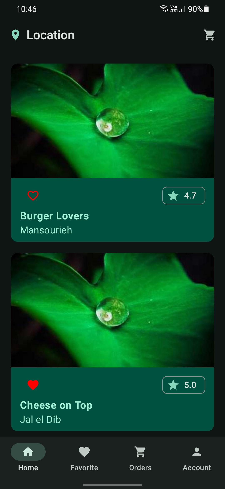
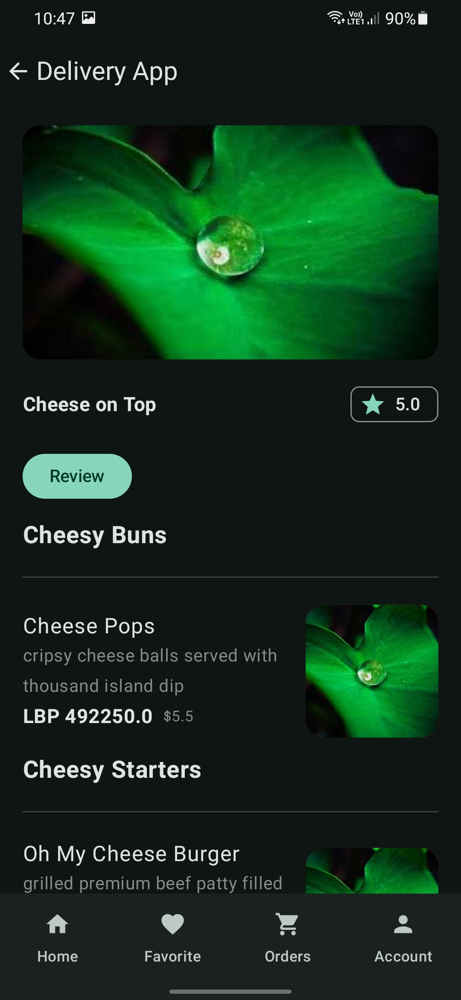

# Moters: The Material Version of _toters_

The application is designed to streamline food ordering and delivery, offering users a seamless experience to discover restaurants, order and track deliveries. It is written in Kotlin for Android devices

## Prerequisites

In order to get started with this application, you will need .NET 8, Android Studio (version 34 of the SDK) and PostgreSQL.

## Getting Started

First, clone the repository.

```
git clone https://github.com/Ghaadyy/delivery-app.git
cd delivery-app
```

Setup the ASP.NET Core Web API

```
cd api/
dotnet restore
```

At this point, you should have installed PostgreSQL and have it up and running. Get your credentials and input them in `appsetting.json` in `ConnectionStrings:DeliveryAppDB`. You must also create a database called `DeliveryApp`.

Next, you should run a migration script using EF Core.

```
dotnet ef migrations add InitialMigration
dotnet ef database update
```

Now, you should have all the tables set up.

Next, open Android Studio and build the project. Run the application with an emulator or a physical device.

> Note that the retrofit services are set up to use the emulator's IP address which allows us to communicate with the host machine which is `10.0.2.2:5299`. However, if you which to test the application on a physical device, you must enter the IP of your machine on the network which is hosting the server: `<machine-ip-address>:5299`. The API is configured to listen on all IP addresses (`0.0.0.0`).

## Project Structure

The main directory contains the android application. However, there is the `api` subdirectory which contains the ASP.NET Core Web API.

## Demo




